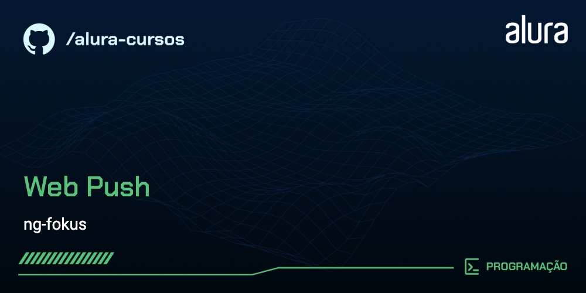

# ng-fokus-backend

A **ng-fokus-backend** é a API de suporte para o aplicativo de gerenciamento de tarefas utilizando o método Pomodoro. Este backend foi desenvolvido para fornecer endpoints necessários para as operações e funcionalidades do aplicativo **ng-fokus**.

## 🔨 Funcionalidades do projeto

A API oferece suporte às funcionalidades principais do aplicativo Pomodoro, permitindo que usuários gerenciem suas tarefas e ciclos de trabalho e pausa. Algumas das principais funcionalidades incluem:

- Autenticação de usuário
- CRUD de tarefas
- Controle de ciclos Pomodoro
- Armazenamento de estatísticas de produtividade
- Envio de notificações utilizando Web Push

## ✔️ Técnicas e tecnologias utilizadas

As técnicas e tecnologias utilizadas no projeto são:

- `Node.js`: plataforma para construção do backend
- `Express`: framework para criação de API RESTful
- `Web Push`: para envio de notificações aos usuários

## 📁 Acesso ao projeto

Você pode [acessar o código fonte do projeto no GitHub](https://github.com/Charlinho/ng-fokus-backend).

## 🛠️ Abrir e rodar o projeto

Para abrir e rodar o projeto, siga os passos abaixo:

1. Clone o repositório do projeto:
   ```bash
   git clone https://github.com/Charlinho/ng-fokus-backend.git
   ```
2. Navegue até o diretório do projeto:
   ```bash
   cd ng-fokus-backend
   ```
3. Instale as dependências:
   ```bash
   npm install
   ```
4. Execute o projeto:
   ```bash
   npm start
   ```
5. A API estará disponível em `http://localhost:3000`.

## 📚 Mais informações

Para mais informações sobre o projeto e suas funcionalidades, visite o [repositório no GitHub](https://github.com/Charlinho/ng-fokus-backend).